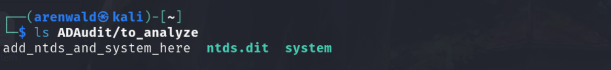
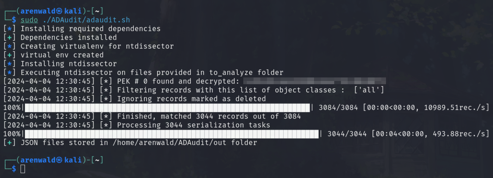

  
  <h1>NTDSauditor</h1>
   

This bash script allows to easily dump NTDS.dit records in JSON files, for auditing or other engagements, using [ntdissector](https://github.com/synacktiv/ntdissector) from [Synacktiv](https://github.com/synacktiv).

## Usage
Drop your **ntds.dit** and **system** files inside the **to_analyze** folder.

Run the script with sudo privileges. When the script is done, you will find your JSON files inside the **out** folder. The full system path is shown on the terminal.

